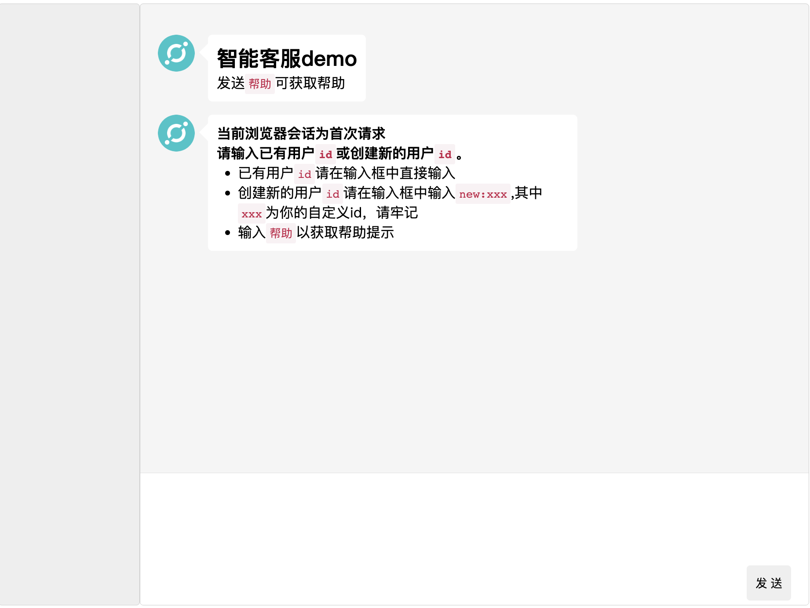
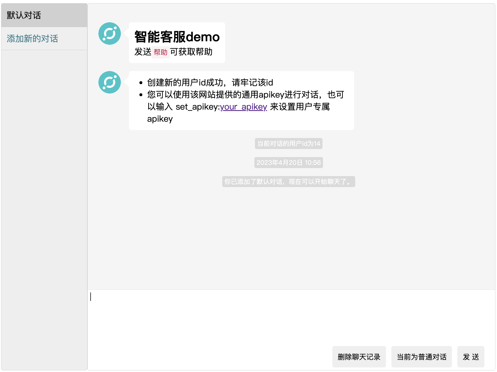
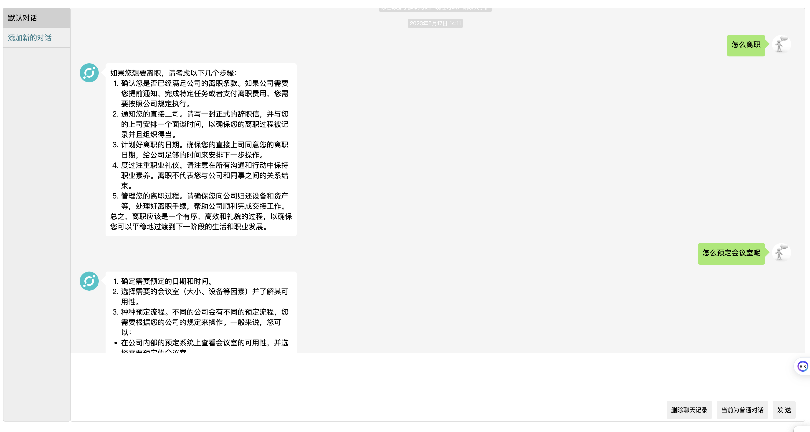
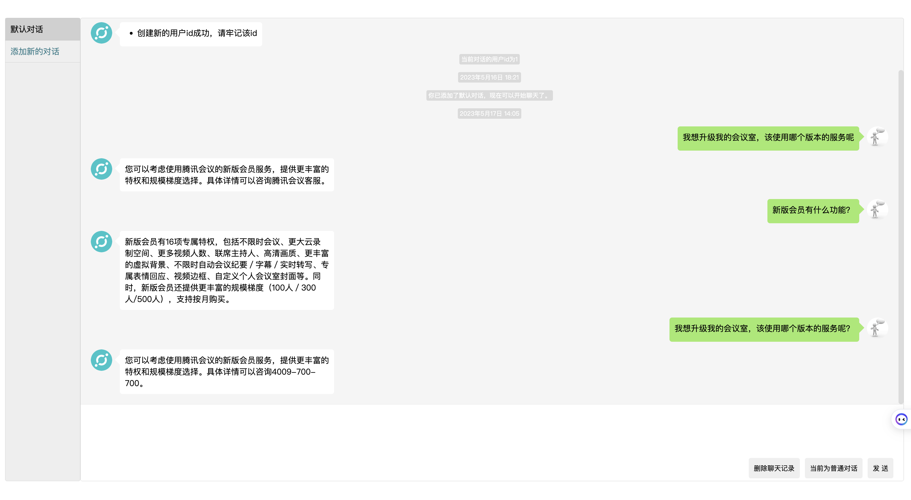
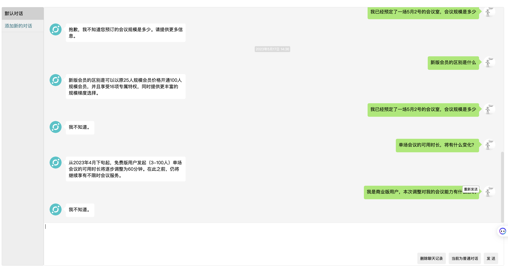

# 使用GPT-3.5 API创建的ChatGPT聊天页面，模型回复效果与官网的ChatGPT一致
 

## 部署方法
分别介绍下面几种部署方法，选择一种即可，部署完成后直接跳转至后面的使用介绍继续即可

1. 本地源代码部署（推荐，方便更新，需要有代理）

> 前提：python3.7及以上运行环境
> 1. 执行 `pip install -r requirements.txt`安装必要包
> 2. 打开`config.yaml`文件，配置HTTPS_PROXY和OPENAI_API_KEY，相关细节已在配置文件中描述
> 5. 执行`python main.py`运行程序.若程序中未指定apikey也可以在终端执行时添加环境变量，如执行`OPANAI_API_KEY=sk-XXXX python main.py`来运行，其中`sk-XXXX`为你的apikey
> 6. 打开本地浏览器访问`127.0.0.1:5000`,部署完成
> 7. 关于更新，当代码更新时，使用git pull更新重新部署即可  

2. Railway部署（推荐，无需代理，云部署，通过url随时随地访问）
  
  
 
  > . 将会跳转至新页面，依次添加`PORT`,`DEPLOY_ON_RAILWAY`以及`OPENAI_API_KEY`三个环境变量,相应值如下PORT为5000，DEPLOY_ON_RAILWAY为true

 
  

## 使用介绍
- 开启程序后进入如下页面  

- 直接输入已有用户id,或者输入new:xxx创建新id，这个id用于绑定会话，下次不同浏览器打开都可以恢复用户的聊天记录,一个浏览器31天内一般不会要求再次输入用户id，如下为创建一个新id，名为zs，下图为发送完成后自动刷新的用户页面，左侧会有一个默认对话  
  
- 默认为普通对话模式，即每次发送都是仅对于该提问回答，可点击切换为连续对话模式，chatgpt将会联系上下文(之前的对话，程序中设置了最大5条记录)回复你

- 对话管理，当不使用该对话时，可以点击删除对话，若当前为默认对话，则只可删除聊天记录

 # 方案
 基于langchain构造本地数据知识库，前后端可以直接部署服务，可以回答工作的一些问题
 * 会议室预定
 * 人事变动
 * 新人培训
 * 流程答疑
# demo演示

